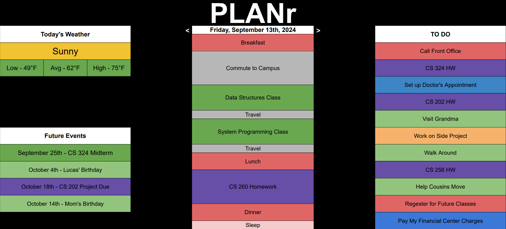

# PLANr
## Elevator Pitch
We all have too much to do an just not enough time. Thankfully technology has offered us the opportunity to accurately plan out our day to day. Just one small problem though, and that is the planners themselves. Planning is a very quick process that involves many decisions initially and many small adjustments as time passes, so why are so many planning applications so clunky and slow? That is where PLANr comes in. A simplistic planning app that aims to convey what you already had in mind and does it quickly and easily. Just add in the plan you have for your day event by event, shift it around as you please, and then execute your plan.

## Design

## Key Features
- Secure login over HTTPS
- Ability to easily navigate between days
- Display of your current day's plan, the weather, up and coming events and to do items you have yet to plan
- Ability to easily resize and adjust each plan within the day, allowing for quick adaptability
- See where you are in your day in real time
- Ability to customize your event's color, time, and catagory easily
- See the weather to help plan more effectively for your day

## Technologies
I am going to use the required technologies in these ways.
- **HTML**: One HTML page for the application and one to log in. 
- **CSS**: General styling that allows for ease of use on different screen sizes. Simple yet contrasting colors for the utility so that users have the greatest freedom in how their own schedule looks with their own selected color schemes.
- **React**: There will be many UI elements because of the inherent customizability and interactivity between the user and their own plans, and react will help with all these aspects in helping provide a smooth experience for the user.
- **Serice**: Live updating weather forcast so that the user will be able to plan accordingly. Endpoints for login as well.
- **DB/Login**: Register and log in users, securly store credentials in a database. 
- **WebSocket**: The time within the day as well as the current date will be displayed on the main page. If development time permits, additionally users will be able to see a breakdown of how they usually spend their time, which will use their data to display pie charts.

## Startup HTML
I deployed the Simon HTML to my production enviroment, and I added...
- My GitHub startup repository to the application's home page
- HTML pages for each component of my application
- Links between all the pages
- A little textual content
- A placeholder image for the icon
- A login placeholder and user name display
- And placeholders for database and WebSocket data